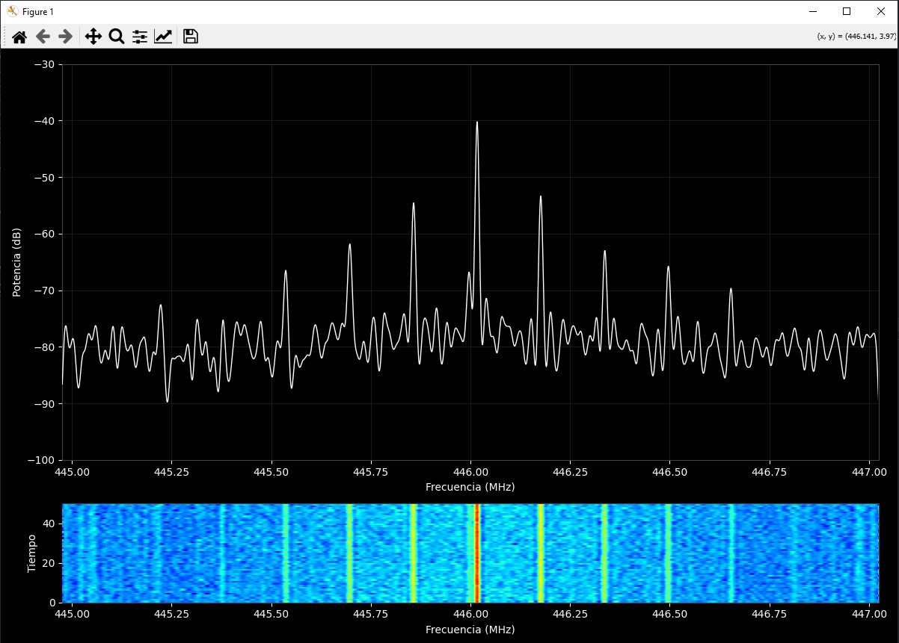

<div align="center">

# 📡 RTL-SDR Signal Analyzer & Jamming Detector

[](https://www.python.org)
[](LICENSE)
[](https://www.rtl-sdr.com)

*A real-time spectrum analyzer and signal detection tool leveraging RTL-SDR hardware for RF monitoring and jamming detection.*

[Features](#-features) • [Installation](#-installation) • [Usage](#-usage) • [Configuration](#%EF%B8%8F-configuration) • [Contributing](#-contributing)

</div>

---

## ✨ Features

- 📊 **Real-time Visualization**: Advanced spectrum analysis with waterfall display
- 🔍 **Smart Detection**: Automatic signal anomaly and jamming detection
- 📈 **Dynamic Analysis**: Adaptive baseline calculation and threshold adjustment
- ⚙️ **Flexible Configuration**: Fully customizable detection parameters
- 🌐 **Network Support**: Built-in RTL-TCP compatibility for remote operation

## 🚀 Installation

### Prerequisites

Before you begin, ensure you have:
- Python 3.8 or newer
- RTL-SDR hardware
- Active RTL-TCP server ([docker-compose.yml](docker/docker-compose.yml))

### Setup

```bash
# Clone the repository
git clone https://github.com/geeknik/rtl-sdr-analyzer.git
cd rtl-sdr-analyzer

# Install required packages
pip install -r requirements.txt
```

## 💻 Usage

1. Start the RTL-TCP server:
```bash
cd docker
docker-compose up -d
```

2. Launch the analyzer:
```bash
python scripts/run_analyzer.py --freq 915e6 --sample-rate 2.048e6
```

### Command Line Options

| Option | Description | Default |
|--------|-------------|---------|
| `--config` | Path to configuration file | None |
| `--host` | RTL-TCP server host | 192.168.31.34 |
| `--port` | RTL-TCP server port | 1234 |
| `--freq` | Center frequency (Hz) | 915e6 |
| `--sample-rate` | Sample rate (Hz) | 2.048e6 |
| `--fft-size` | FFT size | 2048 |
| `--power-threshold` | Signal power threshold (dB) | -70 |
| `--bandwidth-threshold` | Minimum signal bandwidth (Hz) | 100000 |
| `--z-score-threshold` | Statistical deviation threshold | 1.5 |
| `--detection-window` | Analysis window (samples) | 5 |
| `--min-duration` | Minimum event duration (seconds) | 0.1 |
| `--test-mode` | Enable test mode | false |
| `--waterfall-length` | Waterfall display length | 50 |
| `--update-interval` | Display update interval (ms) | 50 |

### Configuration File

You can alternatively run it with a YAML configuration file:

```bash
python scripts/run_analyzer.py --config config.yml
```

Example `config.yml`:
```yaml
rtl_tcp:
  host: "192.168.31.34"
  port: 1234

receiver:
  frequency: 98000000  # 98 MHz
  sample_rate: 2048000  # 2.048 MHz
  fft_size: 2048

detector:
  power_threshold: -70
  bandwidth_threshold: 100000  # 100 kHz
  z_score_threshold: 1.5
  detection_window: 5
  min_duration: 0.1
  test_mode: false

display:
  waterfall_length: 50
  update_interval: 50  # milliseconds
```

## 📊 Signal Analysis Examples

### Walkie-Talkie Transmission (446 MHz)

*Spectrogram showing distinct signal patterns during walkie-talkie transmission at 446 MHz*

### Common Signal Patterns
- 📱 **GSM/LTE**: Characteristic wide-band signals
- 📻 **FM Radio**: Strong, stable signals in the 88-108 MHz range
- 🛜 **Wi-Fi**: Periodic bursts in the 2.4/5 GHz bands
- 🎮 **RF Remote Controls**: Brief, narrow-band transmissions

## 🤝 Contributing

We welcome contributions! To contribute:

1. Fork the repository
2. Create your feature branch (`git checkout -b feature/AmazingFeature`)
3. Commit your changes (`git commit -m 'Add some AmazingFeature'`)
4. Push to the branch (`git push origin feature/AmazingFeature`)
5. Open a Pull Request

## 📄 License

This project is licensed under the MIT License - see the [LICENSE](LICENSE) file for details.

---

<div align="center">
<p>Developed with ❤️ by RF enthusiasts</p>

[Report Bug](https://github.com/msalexms/rtl-sdr-analyzer/issues) • [Request Feature](https://github.com/msalexms/rtl-sdr-analyzer/issues)
</div>
